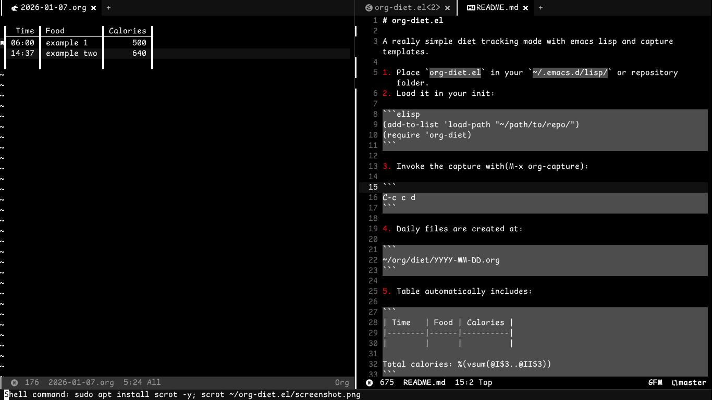

# org-diet.el

A really simple diet tracking made with emacs lisp and capture templates.

1. Git clone 

```sh
cd ~ ; git clone https://github.com/KrzysztofMarciniak/org-diet.el ; nano ~/.config/doom/nano config.el
```

2. Load it into init config.

```elisp
(add-to-list 'load-path "~/org-diet.el")
(require 'org-diet)
```
Remember to reload/restart Emacs.

3. Invoke the capture with:

```
M-x org-capture
```
And select (`d`) - `diet log`. Insert name and calories.

4. Daily files are created at:

```
~/org/diet/YYYY-MM-DD.org
```
